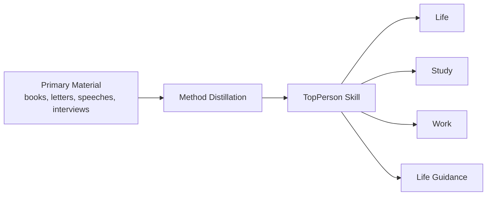

[English](./README.md) | [简体中文](./README.zh-CN.md)

# TopPerson

> Turn top people's methods into AI skills you can actually use.
>
> Not a quote dump.  
> Not fandom.  
> Not roleplay for its own sake.  
> TopPerson is a repository of person-based methods for real decisions and real action.

If you want to ask questions like these:

- How would Zeng Guofan stabilize a chaotic team?
- How would Richard Feynman help me truly understand a topic?
- How would Warren Buffett judge whether this opportunity is worth doing?
- How would Wang Yangming reduce overthinking and push toward action?

This repository is built for that.



## In 10 Seconds

- `TopPerson` is an open-source repository of person-based AI skills.
- It turns a person's judgment style, learning method, and way of acting into modern, lawful, usable AI behavior.
- The repository currently contains `45` skill directories under [`.agents/skills`](./.agents/skills).
- You can use these skills directly in skill-aware AI environments, or load a `SKILL.md` into your own app as a system prompt.

## Why This Repo Is Worth Using

### 1. It focuses on method, not imitation

The goal is not to make AI "sound like" a historical or modern figure.  
The goal is to make AI reason and act with the person's recurring method.

### 2. It starts from sources, not internet folklore

Each skill is meant to be grounded in primary works, credible research, and explicit source boundaries whenever possible.

### 3. It produces action, not admiration

A good TopPerson skill should end in something usable, such as:

- what to do first
- what to avoid
- a 7-day plan
- a 30-day plan
- a draft message

### 4. It has guardrails

This repo does not romanticize power, myth, manipulation, or harmful conduct. Historical context is translated into modern institutions and norms.

## What You Can Use It For

| Area | Typical Problems |
| --- | --- |
| `Life` | self-discipline, habits, emotions, long-term rhythm, recovery from setbacks |
| `Study` | understanding, explaining, practicing, building a learning method |
| `Work` | execution, management, communication, product judgment, decision-making |
| `Life guidance` | major choices, transitions, values, what to do next |

## How To Start

### Option A: Use it directly in a skill-aware AI environment

If your environment supports `.agents/skills`, the fastest path is to invoke a skill directly:

```text
Use $zengguofan-skill to analyze this situation and give me actionable advice.
Use $richardfeynman-skill to help me learn this topic clearly.
Use $wangyangming-skill to help me stop overthinking and start acting.
Use $warrenbuffett-skill to judge whether this opportunity is worth doing.
```

### Option B: Use it in your own AI product

The minimum integration path is:

1. choose a skill
2. read its `SKILL.md`
3. inject that file as a system/developer prompt
4. append the user's actual question

In other words, this repo can be used both as a ready-to-use skill library and as a methods layer for your own AI application.

### Naming Convention

Current skill IDs follow this format:

```text
personname-skill
```

Examples:

- `zengguofan-skill`
- `richardfeynman-skill`
- `wangyangming-skill`
- `leijun-skill`

## Repository Structure

```text
.agents/skills/<skill-id>/
  SKILL.md
  references/
    source-map.md
    principles.md
    demo.zh-CN.md
    demo.en.md
    research.zh-CN.md
    research.en.md
  agents/
    openai.yaml

docs/
  person-catalog*.md
  person-roadmap*.md
  review-checklist*.md

data/
  person-catalog.json

scripts/
  validate_skills.py
  validate_person_catalog.py
  validate_skill_content.py
```

The three files worth opening first are usually:

- [`SKILL.md`](./.agents/skills/zengguofan-skill/SKILL.md): the core method and response shape
- `references/source-map.md`: source hierarchy and confidence
- `references/principles.md`: distilled principles and scenario mapping

## Featured Skills

| Skill | Best For | Example Ask |
| --- | --- | --- |
| [`zengguofan-skill`](./.agents/skills/zengguofan-skill/SKILL.md) | discipline, team order, long-horizon cleanup, crisis handling | "Use Zeng Guofan's method to make me a 30-day reset plan." |
| [`richardfeynman-skill`](./.agents/skills/richardfeynman-skill/SKILL.md) | learning, explanation, understanding, exposing weak spots | "Use Richard Feynman's method to help me truly understand this topic." |
| [`wangyangming-skill`](./.agents/skills/wangyangming-skill/SKILL.md) | reducing inner friction, moving from thought to action | "Use Wang Yangming's method to stop my overthinking and push me into action." |
| [`warrenbuffett-skill`](./.agents/skills/warrenbuffett-skill/SKILL.md) | judgment under uncertainty, patience, filtering noise | "Judge whether this opportunity is worth doing using Buffett's method." |
| [`leijun-skill`](./.agents/skills/leijun-skill/SKILL.md) | product judgment, execution, efficiency, clear communication | "Use Lei Jun's method to judge this product direction." |
| [`luoxiang-skill`](./.agents/skills/luoxiang-skill/SKILL.md) | principled reasoning, boundaries, public explanation | "Use Luo Xiang's method to explain the principle and boundary in this case." |

## Browse Current Skills

<details>
<summary>View the current 45 skills</summary>

### Established

- [`zengguofan-skill`](./.agents/skills/zengguofan-skill/SKILL.md): Qing statesman and military leader known for self-discipline, team building, and long-horizon order.
- [`andygrove-skill`](./.agents/skills/andygrove-skill/SKILL.md): Former Intel CEO known for paranoid management and execution systems.
- [`benjaminfranklin-skill`](./.agents/skills/benjaminfranklin-skill/SKILL.md): Statesman, inventor, and writer known for habits, self-improvement, and pragmatism.
- [`caocao-skill`](./.agents/skills/caocao-skill/SKILL.md): Three Kingdoms statesman, warlord, and poet known for strategy and talent use.
- [`caodewang-skill`](./.agents/skills/caodewang-skill/SKILL.md): Founder of Fuyao Glass known for industrial discipline, cost awareness, and pragmatic execution.
- [`charliemunger-skill`](./.agents/skills/charliemunger-skill/SKILL.md): Investor and Buffett's longtime partner known for mental models and avoiding stupidity.
- [`duanyongping-skill`](./.agents/skills/duanyongping-skill/SKILL.md): Chinese entrepreneur and investor known for long-termism, selective focus, and business judgment.
- [`elonmusk-skill`](./.agents/skills/elonmusk-skill/SKILL.md): Entrepreneur known for first-principles thinking, technical boldness, and hard trade-offs.
- [`harukimurakami-skill`](./.agents/skills/harukimurakami-skill/SKILL.md): Japanese novelist known for routine, endurance, and long solitary creative work.
- [`hayaomiyazaki-skill`](./.agents/skills/hayaomiyazaki-skill/SKILL.md): Japanese animator and director known for craft discipline and creative standards.
- [`jackma-skill`](./.agents/skills/jackma-skill/SKILL.md): Entrepreneur and communicator known for market education and organizational energy.
- [`jeffbezos-skill`](./.agents/skills/jeffbezos-skill/SKILL.md): Amazon founder known for customer obsession, flywheel thinking, and long-term building.
- [`jensenhuang-skill`](./.agents/skills/jensenhuang-skill/SKILL.md): NVIDIA founder known for long-term R&D, technical strategy, and founder leadership.
- [`kazuoinamori-skill`](./.agents/skills/kazuoinamori-skill/SKILL.md): Kyocera founder known for management discipline, altruism, and long-term organization building.
- [`kobebryant-skill`](./.agents/skills/kobebryant-skill/SKILL.md): Basketball icon known for discipline, deliberate practice, and competitive standards.
- [`konosukematsushita-skill`](./.agents/skills/konosukematsushita-skill/SKILL.md): Panasonic founder known for management philosophy, people development, and enterprise building.
- [`leekuanyew-skill`](./.agents/skills/leekuanyew-skill/SKILL.md): Founding Prime Minister of Singapore known for institutional design and pragmatic trade-offs.
- [`leijun-skill`](./.agents/skills/leijun-skill/SKILL.md): Entrepreneur and product-minded founder known for product judgment, efficiency, and sincere communication.
- [`luoxiang-skill`](./.agents/skills/luoxiang-skill/SKILL.md): Law professor and public educator known for principled reasoning and clear explanation.
- [`marcusaurelius-skill`](./.agents/skills/marcusaurelius-skill/SKILL.md): Roman emperor and Stoic thinker known for self-command, emotional steadiness, and duty.
- [`napoleon-skill`](./.agents/skills/napoleon-skill/SKILL.md): Military and political leader known for strategy, timing, and concentration of effort.
- [`peterdrucker-skill`](./.agents/skills/peterdrucker-skill/SKILL.md): Foundational management thinker known for objectives and knowledge work effectiveness.
- [`rafaelnadal-skill`](./.agents/skills/rafaelnadal-skill/SKILL.md): Tennis champion known for resilience, consistency, and low-error execution.
- [`raydalio-skill`](./.agents/skills/raydalio-skill/SKILL.md): Bridgewater founder known for principles, systemized decisions, and feedback loops.
- [`renzhengfei-skill`](./.agents/skills/renzhengfei-skill/SKILL.md): Huawei founder known for crisis awareness, survival thinking, and organizational discipline.
- [`richardfeynman-skill`](./.agents/skills/richardfeynman-skill/SKILL.md): Physicist and explainer known for understanding, explanation, and curiosity.
- [`stevejobs-skill`](./.agents/skills/stevejobs-skill/SKILL.md): Apple co-founder known for product taste, focus, and high standards.
- [`sushi-skill`](./.agents/skills/sushi-skill/SKILL.md): Song dynasty writer and statesman known for resilience, emotional balance, and life order under adversity.
- [`wangxing-skill`](./.agents/skills/wangxing-skill/SKILL.md): Founder of Meituan known for competitive judgment, strategic focus, and organizational scaling.
- [`wangyangming-skill`](./.agents/skills/wangyangming-skill/SKILL.md): Ming dynasty thinker and general known for unity of knowledge and action.
- [`warrenbuffett-skill`](./.agents/skills/warrenbuffett-skill/SKILL.md): Long-term investing icon known for circle of competence, patience, and durable decisions.
- [`zhangyiming-skill`](./.agents/skills/zhangyiming-skill/SKILL.md): ByteDance founder known for rational decision-making, information processing, and mechanism design.
- [`zhugeliang-skill`](./.agents/skills/zhugeliang-skill/SKILL.md): Three Kingdoms strategist and statesman known for planning discipline, diligence, and conscientious execution.

### Draft Skills

- [`confucius-skill`](./.agents/skills/confucius-skill/SKILL.md): Classical Chinese teacher and thinker known for conduct, learning, role responsibility, and everyday order.
- [`hushi-skill`](./.agents/skills/hushi-skill/SKILL.md): Modern Chinese writer and thinker known for evidence, skepticism, and plain expression.
- [`taoxingzhi-skill`](./.agents/skills/taoxingzhi-skill/SKILL.md): Educator known for learning by doing and practical education.
- [`qianxuesen-skill`](./.agents/skills/qianxuesen-skill/SKILL.md): Scientist and engineer known for systems thinking and complex-project synthesis.
- [`yuanlongping-skill`](./.agents/skills/yuanlongping-skill/SKILL.md): Agricultural scientist known for field-tested persistence and practical science.
- [`tuyouyou-skill`](./.agents/skills/tuyouyou-skill/SKILL.md): Scientist known for evidence extraction, quiet rigor, and patient validation.
- [`mahuateng-skill`](./.agents/skills/mahuateng-skill/SKILL.md): Founder of Tencent known for product restraint, pacing, and platform judgment.
- [`zhangruimin-skill`](./.agents/skills/zhangruimin-skill/SKILL.md): Haier leader known for accountability, self-disruption, and user-facing organizational change.
- [`viktorfrankl-skill`](./.agents/skills/viktorfrankl-skill/SKILL.md): Psychiatrist and thinker known for meaning, agency, and response under suffering.
- [`taiichiohno-skill`](./.agents/skills/taiichiohno-skill/SKILL.md): Toyota production pioneer known for waste reduction, process discipline, and go-to-gemba observation.
- [`satyanadella-skill`](./.agents/skills/satyanadella-skill/SKILL.md): Microsoft CEO known for empathy, learning culture, and strategic renewal.
- [`danielkahneman-skill`](./.agents/skills/danielkahneman-skill/SKILL.md): Psychologist known for bias reduction, decision hygiene, and noise control.

</details>

## Dataset And Roadmap

If you want to expand beyond the current skill set, keep going here:

- person catalog guide: [`docs/person-catalog.md`](./docs/person-catalog.md)
- person catalog data: [`data/person-catalog.json`](./data/person-catalog.json)
- person roadmap: [`docs/person-roadmap.md`](./docs/person-roadmap.md)
- Chinese versions: [`docs/person-catalog.zh-CN.md`](./docs/person-catalog.zh-CN.md), [`docs/person-roadmap.zh-CN.md`](./docs/person-roadmap.zh-CN.md)

## Want To Add A New Person Skill?

The shortest path is:

1. pick a person with strong source material
2. explain why ordinary users can borrow this person's method
3. define the main use case
4. list primary and secondary sources
5. fill the template and open a PR

Start here:

- [`CONTRIBUTING.md`](./CONTRIBUTING.md)
- [`CONTRIBUTING.zh-CN.md`](./CONTRIBUTING.zh-CN.md)
- [`docs/review-checklist.md`](./docs/review-checklist.md)
- [`docs/review-checklist.zh-CN.md`](./docs/review-checklist.zh-CN.md)

Template files:

- [`templates/person-skill/SKILL.md`](./templates/person-skill/SKILL.md)
- [`templates/person-skill/references/source-map.md`](./templates/person-skill/references/source-map.md)
- [`templates/person-skill/references/principles.md`](./templates/person-skill/references/principles.md)
- [`templates/person-skill/agents/openai.yaml`](./templates/person-skill/agents/openai.yaml)

## Validation

Before opening a PR, run:

```bash
python3 scripts/validate_skills.py
python3 scripts/validate_person_catalog.py
python3 scripts/validate_skill_content.py
```

## License

This repository is released under the [`MIT License`](./LICENSE).
