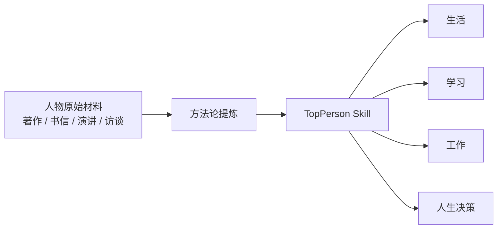

[English](./README.md) | [简体中文](./README.zh-CN.md)

# 顶尖人 TopPerson

> 把顶尖人物的方法论，整理成 AI 可以直接调用的 skill。
>
> 不是语录库。  
> 不是名人崇拜。  
> 不是“模仿谁说话”。  
> 它更像一个面向现实问题的人物方法论仓库。

如果你想问这些问题：

- 如果按曾国藩的方法，怎么收拾一个混乱团队？
- 如果按费曼的方法，怎么把一个知识点学明白？
- 如果按巴菲特的方法，怎么判断一个机会值不值得做？
- 如果按王阳明的方法，怎么少内耗、快行动？

这个仓库就是为这件事准备的。



## 10 秒了解

- `TopPerson` 是一个开源的人物方法论 AI skill 仓库。
- 它把顶尖人物的判断方式、学习方式、做事方式，翻译成现代、合法、可执行的 AI 能力。
- 当前收录 `45` 个 skill，位于 [`.agents/skills`](./.agents/skills)。
- 你可以直接在支持 skill 的 AI 环境中调用，也可以把某个人物的 `SKILL.md` 拿去接到自己的 AI 产品里。

## 为什么这个仓库值得用

### 1. 重方法，不重表演

这里的重点不是“像谁说话”，而是“像谁那样判断和行动”。

### 2. 从来源出发，不从流行梗出发

每个 skill 都尽量基于人物的一手资料、可信研究和明确的证据边界，而不是只靠流传语录。

### 3. 输出的是方案，不是感想

一个好的 TopPerson skill，最终会把方法落到现实动作上，例如：

- 先办什么
- 暂不做什么
- 7 天节奏
- 30 天计划
- 沟通草稿

### 4. 有明确边界

这个仓库不会把人物神化，也不会把历史人物的时代背景直接照搬到今天，更不会为操控、伤害、违法内容背书。

## 你可以拿它解决什么问题

| 场景 | 典型问题 |
| --- | --- |
| `生活` | 自律、习惯、情绪、长期节奏、低谷调整 |
| `学习` | 如何理解、如何解释、如何练习、如何建立自己的学习方法 |
| `工作` | 带人、执行、沟通、管理、产品判断、取舍 |
| `人生指导` | 要不要做、怎么选、怎么熬、怎么判断下一步 |

## 怎么开始用

### 方式 A：直接在支持 skill 的 AI 环境里调用

如果你的环境支持 `.agents/skills`，最简单的用法就是直接写：

```text
Use $zengguofan-skill to analyze this situation and give me actionable advice.
Use $richardfeynman-skill to help me learn this topic clearly.
Use $wangyangming-skill to help me stop overthinking and start acting.
Use $warrenbuffett-skill to judge whether this opportunity is worth doing.
```

### 方式 B：在你自己的 AI 项目里使用

最小接法是：

1. 选一个人物 skill  
2. 读取对应目录下的 `SKILL.md`
3. 把它作为 system prompt / developer prompt 注入模型
4. 再把用户问题发进去

也就是说，这个仓库既可以直接拿来用，也可以当成你的 AI 产品的“人物方法论底座”。

### 命名规则

当前 skill ID 统一使用：

```text
personname-skill
```

例如：

- `zengguofan-skill`
- `richardfeynman-skill`
- `wangyangming-skill`
- `leijun-skill`

## 仓库结构

```text
.agents/skills/<skill-id>/
  SKILL.md
  references/
    source-map.md
    principles.md
    demo.zh-CN.md
    demo.en.md
    research.zh-CN.md
    research.en.md
  agents/
    openai.yaml

docs/
  person-catalog*.md
  person-roadmap*.md
  review-checklist*.md

data/
  person-catalog.json

scripts/
  validate_skills.py
  validate_person_catalog.py
  validate_skill_content.py
```

你通常只需要先看三样：

- [`SKILL.md`](./.agents/skills/zengguofan-skill/SKILL.md)：这个人物的核心方法和输出格式
- `references/source-map.md`：材料来源和置信度
- `references/principles.md`：提炼后的原则和场景映射

## 代表 Skill

| Skill | 更适合处理什么 | 你可以怎么问 |
| --- | --- | --- |
| [`zengguofan-skill`](./.agents/skills/zengguofan-skill/SKILL.md) | 修身、带队、长期整顿、危机收拾 | “按曾国藩的方法，帮我定一个 30 天整顿计划。” |
| [`richardfeynman-skill`](./.agents/skills/richardfeynman-skill/SKILL.md) | 学习、理解、解释、拆解卡点 | “用费曼的方法帮我把这个知识点学明白。” |
| [`wangyangming-skill`](./.agents/skills/wangyangming-skill/SKILL.md) | 知行合一、少内耗、快行动 | “我总想太多做太少，用王阳明的方法帮我拆。” |
| [`warrenbuffett-skill`](./.agents/skills/warrenbuffett-skill/SKILL.md) | 判断机会、长期决策、克制冲动 | “这个机会值不值得做？请按巴菲特方式判断。” |
| [`leijun-skill`](./.agents/skills/leijun-skill/SKILL.md) | 产品判断、效率、执行、表达 | “这个产品方向要不要继续做？” |
| [`luoxiang-skill`](./.agents/skills/luoxiang-skill/SKILL.md) | 原则推理、边界判断、公开解释 | “这件事在原则和边界上该怎么讲清楚？” |

## 浏览当前 Skill

<details>
<summary>查看当前 45 个 skill</summary>

### 已完成

- [`曾国藩 / zengguofan-skill`](./.agents/skills/zengguofan-skill/SKILL.md)：晚清重臣与湘军领袖，常被用来讨论修身、带队和长期整顿。
- [`安迪·格鲁夫 / andygrove-skill`](./.agents/skills/andygrove-skill/SKILL.md)：Intel 前 CEO，以高标准管理、危机感和执行系统著称。
- [`本杰明·富兰克林 / benjaminfranklin-skill`](./.agents/skills/benjaminfranklin-skill/SKILL.md)：政治家、发明家、作家，常被视为习惯养成与自我改进的代表人物。
- [`曹操 / caocao-skill`](./.agents/skills/caocao-skill/SKILL.md)：三国政治家、军事家、诗人，代表现实判断、战略与用人。
- [`曹德旺 / caodewang-skill`](./.agents/skills/caodewang-skill/SKILL.md)：福耀玻璃创始人，代表实业经营、成本意识和务实执行。
- [`查理·芒格 / charliemunger-skill`](./.agents/skills/charliemunger-skill/SKILL.md)：投资人、巴菲特长期搭档，代表多元思维模型与“避免愚蠢”。
- [`段永平 / duanyongping-skill`](./.agents/skills/duanyongping-skill/SKILL.md)：企业家与投资人，代表长期主义、取舍和商业判断。
- [`马斯克 / elonmusk-skill`](./.agents/skills/elonmusk-skill/SKILL.md)：企业家，代表第一性原理、技术冒险和强边界判断。
- [`村上春树 / harukimurakami-skill`](./.agents/skills/harukimurakami-skill/SKILL.md)：日本小说家，代表节律、耐力和长期独立创作。
- [`宫崎骏 / hayaomiyazaki-skill`](./.agents/skills/hayaomiyazaki-skill/SKILL.md)：日本动画导演，代表创作标准、工匠纪律和长期创作。
- [`马云 / jackma-skill`](./.agents/skills/jackma-skill/SKILL.md)：企业家与演讲者，代表表达、市场教育和组织动员。
- [`贝索斯 / jeffbezos-skill`](./.agents/skills/jeffbezos-skill/SKILL.md)：Amazon 创始人，代表用户导向、飞轮思维和长期建设。
- [`黄仁勋 / jensenhuang-skill`](./.agents/skills/jensenhuang-skill/SKILL.md)：NVIDIA 创始人，代表长期研发、技术战略和创始人领导力。
- [`稻盛和夫 / kazuoinamori-skill`](./.agents/skills/kazuoinamori-skill/SKILL.md)：京瓷创始人，代表经营、自律、利他和长期组织建设。
- [`科比 / kobebryant-skill`](./.agents/skills/kobebryant-skill/SKILL.md)：篮球运动员，代表纪律、刻意练习和竞争标准。
- [`松下幸之助 / konosukematsushita-skill`](./.agents/skills/konosukematsushita-skill/SKILL.md)：松下电器创始人，代表经营哲学、育人和长期企业建设。
- [`李光耀 / leekuanyew-skill`](./.agents/skills/leekuanyew-skill/SKILL.md)：新加坡建国总理，代表长期规划、制度设计和现实取舍。
- [`雷军 / leijun-skill`](./.agents/skills/leijun-skill/SKILL.md)：企业家与产品型创始人，代表产品判断、效率、执行和真诚表达。
- [`罗翔 / luoxiang-skill`](./.agents/skills/luoxiang-skill/SKILL.md)：法学教师与普法讲者，代表原则推理、边界意识和公开解释。
- [`马可·奥勒留 / marcusaurelius-skill`](./.agents/skills/marcusaurelius-skill/SKILL.md)：古罗马皇帝与斯多葛代表人物，代表自我克制、情绪调节和责任感。
- [`拿破仑 / napoleon-skill`](./.agents/skills/napoleon-skill/SKILL.md)：法国军事与政治人物，代表战略、时机和集中力量。
- [`彼得·德鲁克 / peterdrucker-skill`](./.agents/skills/peterdrucker-skill/SKILL.md)：现代管理学代表人物，代表管理、目标和知识工作效率。
- [`纳达尔 / rafaelnadal-skill`](./.agents/skills/rafaelnadal-skill/SKILL.md)：网球运动员，代表稳定性、韧性和低失误执行。
- [`Ray Dalio / raydalio-skill`](./.agents/skills/raydalio-skill/SKILL.md)：桥水创始人，代表原则、系统化决策和反馈回路。
- [`任正非 / renzhengfei-skill`](./.agents/skills/renzhengfei-skill/SKILL.md)：华为创始人，代表危机意识、生存、组织和灰度管理。
- [`理查德·费曼 / richardfeynman-skill`](./.agents/skills/richardfeynman-skill/SKILL.md)：物理学家与科普讲者，代表学习、理解、解释和好奇心。
- [`乔布斯 / stevejobs-skill`](./.agents/skills/stevejobs-skill/SKILL.md)：Apple 共同创始人，代表产品品味、聚焦和高标准。
- [`苏轼 / sushi-skill`](./.agents/skills/sushi-skill/SKILL.md)：宋代文学家、书法家、官员，代表逆境弹性、情绪平衡和人生秩序。
- [`王兴 / wangxing-skill`](./.agents/skills/wangxing-skill/SKILL.md)：美团创始人，代表竞争判断、战略聚焦和组织扩张。
- [`王阳明 / wangyangming-skill`](./.agents/skills/wangyangming-skill/SKILL.md)：明代思想家、军事家，代表知行合一、行动和内耗治理。
- [`巴菲特 / warrenbuffett-skill`](./.agents/skills/warrenbuffett-skill/SKILL.md)：长期投资代表人物，代表能力圈、长期决策和耐心。
- [`张一鸣 / zhangyiming-skill`](./.agents/skills/zhangyiming-skill/SKILL.md)：字节跳动创始人，代表理性决策、信息处理和机制设计。
- [`诸葛亮 / zhugeliang-skill`](./.agents/skills/zhugeliang-skill/SKILL.md)：三国政治家、军事家，代表规划纪律、勤勉和尽责执行。

### Draft Skills

- [`孔子 / confucius-skill`](./.agents/skills/confucius-skill/SKILL.md)：先秦思想家与教育者，代表修身、学习、角色责任与日常秩序。
- [`胡适 / hushi-skill`](./.agents/skills/hushi-skill/SKILL.md)：现代思想家与写作者，代表证据意识、怀疑精神和清楚表达。
- [`陶行知 / taoxingzhi-skill`](./.agents/skills/taoxingzhi-skill/SKILL.md)：教育家，代表教学做合一与实践成长。
- [`钱学森 / qianxuesen-skill`](./.agents/skills/qianxuesen-skill/SKILL.md)：科学家与工程家，代表系统思维和复杂工程综合判断。
- [`袁隆平 / yuanlongping-skill`](./.agents/skills/yuanlongping-skill/SKILL.md)：农业科学家，代表田野验证、长期试验和务实科研。
- [`屠呦呦 / tuyouyou-skill`](./.agents/skills/tuyouyou-skill/SKILL.md)：科学家，代表证据提取、安静求真和耐心验证。
- [`马化腾 / mahuateng-skill`](./.agents/skills/mahuateng-skill/SKILL.md)：腾讯创始人，代表产品克制、节奏判断与平台思维。
- [`张瑞敏 / zhangruimin-skill`](./.agents/skills/zhangruimin-skill/SKILL.md)：海尔管理者，代表问责、自我颠覆和组织变革。
- [`维克多·弗兰克尔 / viktorfrankl-skill`](./.agents/skills/viktorfrankl-skill/SKILL.md)：精神科医生与思想家，代表意义感、主体性和困境应对。
- [`大野耐一 / taiichiohno-skill`](./.agents/skills/taiichiohno-skill/SKILL.md)：丰田生产方式代表人物，代表去浪费、现场观察和流程优化。
- [`萨提亚·纳德拉 / satyanadella-skill`](./.agents/skills/satyanadella-skill/SKILL.md)：微软 CEO，代表共情、学习型文化和组织更新。
- [`丹尼尔·卡尼曼 / danielkahneman-skill`](./.agents/skills/danielkahneman-skill/SKILL.md)：心理学家，代表偏差识别、决策卫生和降噪。

</details>

## 数据集与路线图

如果你想继续扩展人物池，不只看当前 skill，可以继续看：

- 蒸馏数据集说明：[`docs/person-catalog.zh-CN.md`](./docs/person-catalog.zh-CN.md)
- 数据集 JSON：[`data/person-catalog.json`](./data/person-catalog.json)
- 蒸馏 roadmap：[`docs/person-roadmap.zh-CN.md`](./docs/person-roadmap.zh-CN.md)
- 英文对应文档：[`docs/person-catalog.md`](./docs/person-catalog.md)、[`docs/person-roadmap.md`](./docs/person-roadmap.md)

## 想新增一个人物 Skill？

最短路径是：

1. 先选一个资料扎实的人物
2. 说明普通人为什么值得借这个人的方法
3. 写清这个 skill 主要解决什么问题
4. 列出一手资料和二手资料
5. 按模板补全并提交 PR

入口文档：

- [`CONTRIBUTING.zh-CN.md`](./CONTRIBUTING.zh-CN.md)
- [`CONTRIBUTING.md`](./CONTRIBUTING.md)
- [`docs/review-checklist.zh-CN.md`](./docs/review-checklist.zh-CN.md)
- [`docs/review-checklist.md`](./docs/review-checklist.md)

模板文件：

- [`templates/person-skill/SKILL.md`](./templates/person-skill/SKILL.md)
- [`templates/person-skill/references/source-map.md`](./templates/person-skill/references/source-map.md)
- [`templates/person-skill/references/principles.md`](./templates/person-skill/references/principles.md)
- [`templates/person-skill/agents/openai.yaml`](./templates/person-skill/agents/openai.yaml)

## 校验

发 PR 前建议运行：

```bash
python3 scripts/validate_skills.py
python3 scripts/validate_person_catalog.py
python3 scripts/validate_skill_content.py
```

## License

本仓库采用 [`MIT License`](./LICENSE)。
